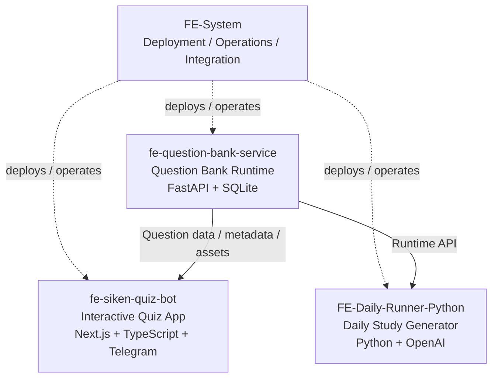

# FE Study System

A modular learning platform for Japan's **Fundamental Information Technology Engineer Examination (FE)**.

The system combines a shared FE question-bank service, an interactive web quiz application with Telegram integration, and an AI-assisted daily study workflow.

This repository, **FE-System**, is the integration and operations hub for the complete platform. It does not replace the individual application repositories; instead, it brings them together for deployment and operation on a single VPS.

## Architecture



At runtime, `fe-question-bank-service` acts as the shared question-data layer.

Both the interactive quiz application and the daily study generator consume the same question-bank service, while `FE-System` provides the deployment, host-level configuration, and operational tooling that ties the services together.

## Components

| Repository                                                                    | Role                                                                                                  | Main Stack                                   |
| ----------------------------------------------------------------------------- | ----------------------------------------------------------------------------------------------------- | -------------------------------------------- |
| [fe-question-bank-service](https://github.com/zcorw/fe-question-bank-service) | Shared FE question-bank runtime providing question data, metadata, keyword mappings, and image assets | FastAPI, SQLite, Docker                      |
| [fe-siken-quiz-bot](https://github.com/zcorw/fe-siken-quiz-bot)               | Interactive FE practice application with browser-based quizzes and Telegram integration               | Next.js, React, TypeScript, Telegram, SQLite |
| [FE-Daily-Runner-Python](https://github.com/zcorw/FE-Daily-Runner-Python)     | Generates personalized daily FE study pages using question-bank data and OpenAI                       | Python, OpenAI API, Jinja2, Docker           |
| **FE-System**                                                                 | Deployment, integration, host configuration, and operational scripts for the complete platform        | Docker, Nginx, systemd, Shell                |

## How the Components Work Together

### 1. Shared Question Bank

`fe-question-bank-service` is the central question-data service.

It provides:

* FE question data
* Question metadata and topic information
* Keyword mappings
* Cached question images and other assets
* Runtime HTTP APIs for consumer applications

Other services access it over the shared Docker network:

```text
http://question-bank-runtime:8000
```

This keeps question-bank ownership separate from the applications that consume the data.

### 2. Interactive Quiz Application

`fe-siken-quiz-bot` provides the interactive practice experience.

Users can select a practice scope through Telegram, open a generated quiz URL, answer questions in the browser, and review scores, explanations, and previous mistakes.

The application can retrieve FE question data from `fe-question-bank-service` instead of maintaining its own independent question source.

### 3. Daily Study Generator

`FE-Daily-Runner-Python` generates daily study content based on learning context such as progress, weak points, and previous mistakes.

The workflow:

```text
Study Context
     +
Question Bank Runtime
     +
OpenAI
     ↓
Daily Study Content
     ↓
Static Study Page
     ↓
Telegram Notification
```

The runner consumes question data through the Question Bank Runtime API rather than directly reading the question-bank SQLite database.

### 4. Integration and Operations

`FE-System` is responsible for operating these components as one platform.

It provides:

* Repository coordination
* Deployment order
* Host-level Nginx configuration
* systemd service/timer configuration
* Shared Docker-network setup
* Deployment scripts
* Runtime asset installation
* Production deployment documentation

## Deployment Overview

The complete FE learning stack is designed to run on one VPS.

The normal deployment order is:

```text
1. fe-question-bank-service
        ↓
2. fe-siken-quiz-bot
        ↓
3. FE-Daily-Runner-Python
```

The Question Bank Runtime starts first because the other applications depend on its runtime API and assets.

## Repository Layout

```text
.
├── README.md
├── repos.yaml
├── deploy/
│   ├── artifacts/
│   ├── nginx/
│   └── systemd/
├── docs/
├── scripts/
└── services/
    ├── FE-Daily-Runner/
    ├── FE-telegram-bot/
    └── fe-question-bank-service/
```

The directories under `services/` contain local checkouts of the application repositories managed by this integration repository.

## Repository Configuration

`repos.yaml` defines the upstream repositories, local paths, roles, branches, and deployment order.

Example structure:

```yaml
services:
  - name: fe-question-bank-service
    path: services/fe-question-bank-service
    role: question-bank-runtime
    deploy_order: 1

  - name: FE-telegram-bot
    path: services/FE-telegram-bot
    role: telegram-web-edge-bot
    deploy_order: 2

  - name: FE-Daily-Runner
    path: services/FE-Daily-Runner
    role: daily-page-generator
    deploy_order: 3
```

## Quick Start

### 1. Pull the service repositories

```bash
./scripts/pull-repos.sh
```

This clones or updates the application repositories defined in `repos.yaml`.

### 2. Configure each service

Create the required production `.env` files inside the corresponding service directories.

Use the `.env.example` or production environment templates provided by each application as the starting point.

Do not commit real secrets.

### 3. Deploy the stack

```bash
./scripts/deploy-all.sh
```

The deployment script starts and validates the services in dependency order.

### 4. Install host configuration

Install the required Nginx and systemd configuration from:

```text
deploy/nginx/
deploy/systemd/
```

For the full production procedure, see:

```text
docs/production-deployment.md
```

## Important Files

### `repos.yaml`

Defines:

* Upstream Git repositories
* Local service paths
* Target branches
* Service roles
* Deployment order

### `deploy/nginx/`

Contains host-level Nginx configuration examples used to expose the application services and static content.

### `deploy/systemd/`

Contains systemd service and timer definitions used for scheduled workflows such as the Daily Runner.

### `deploy/artifacts/`

Contains deployment artifacts that need to be installed into the runtime environment.

### `scripts/pull-repos.sh`

Clones or updates all service repositories.

### `scripts/install-assets.sh`

Installs:

```text
deploy/artifacts/public.zip
```

into the Question Bank service's configured `HOST_ASSET_DIR`.

### `scripts/deploy-all.sh`

Deploys and validates the complete application stack.

### `docs/production-deployment.md`

Contains the full production deployment procedure.

### `docs/deployment-missing-requirements.md`

Records the latest deployment validation status and unresolved deployment requirements.

## Runtime Boundaries

The applications are intentionally separated by responsibility.

```text
Question Bank Service
        │
        ├── owns question data
        ├── owns question assets
        └── exposes Runtime API
                 │
          ┌──────┴──────┐
          │             │
          ▼             ▼
     Quiz App      Daily Runner
```

Consumer applications should use the Question Bank Runtime API rather than directly depending on the question-bank database or internal asset storage.

This separation allows the question bank to evolve independently from the applications using it.

## Shared Docker Network

The services communicate through a shared Docker network.

The Question Bank Runtime is normally available to other containers as:

```text
http://question-bank-runtime:8000
```

This hostname is intended for container-to-container communication and is not necessarily exposed directly to the public internet.

## Related Legacy Project

[FE-Daily-Runner](https://github.com/zcorw/FE-Daily-Runner) is the original implementation of the daily study publishing workflow.

It used a more tightly coupled architecture based on Codex orchestration, direct SQLite access, and Git-based publishing.

The current implementation, `FE-Daily-Runner-Python`, replaces that workflow with:

* Python-based orchestration
* OpenAI API integration
* Question Bank Runtime API consumption
* Explicit static-page generation
* Cleaner separation between data, generation, and deployment

The legacy repository is retained primarily as development history and reference material and is not part of the current production architecture.

## Secret Handling

Never commit production secrets or runtime credentials.

Keep the following outside Git:

* `services/*/.env`
* OpenAI API keys
* Telegram bot tokens
* Telegram webhook secrets
* SSH private keys
* SQLite WAL/SHM files
* Generated runtime logs
* Runtime state files

If a secret is accidentally committed or published, rotate it before deploying the affected service.

## Project Goal

FE Study System is intended not as a single monolithic application, but as a small service-oriented learning platform in which:

* question-bank data is maintained centrally,
* multiple learning applications can consume the same data,
* interactive and automated learning workflows remain independent,
* and deployment infrastructure is managed separately from application code.

This structure makes it possible to evolve the question bank, quiz experience, AI-assisted study workflow, and deployment environment independently while operating them as one integrated system.
